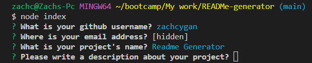
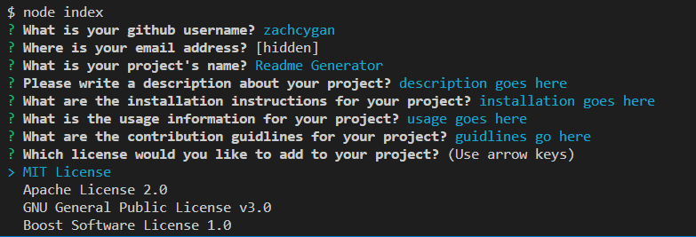
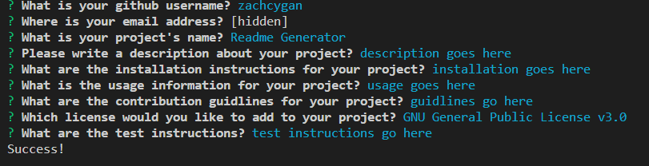
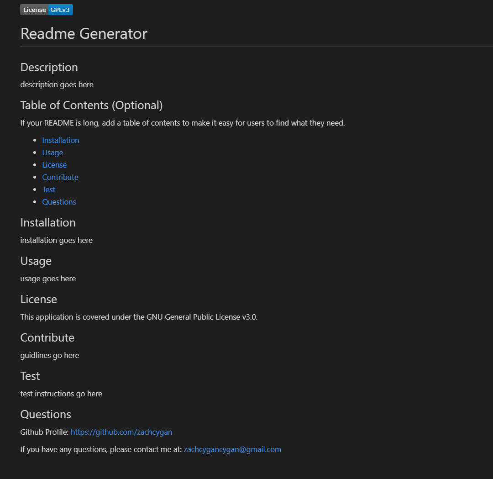

# README-Generator

## Description

My motivation for this project is to make it easier to develop READMEs in the future. Simply run the program and answer the questions prompted to you and the readMe file will be generated inside the folder it is located in. 

## Installation

The webpage is available at https://zachcygan.github.io/READMe-generator. Be sure to install any dependencies by typing in "npm i" in the console. This will install inquirer, the backbone of this project. 

## Instructions

To begin installing the program, to be sure to type "npm i" inside the terminal to install any dependencies. To run the program type, "npm index.js" inside the terminal. This prompt the user with the questions that will populate the readme file. When the program is done, "Sucess!" will be printed to the console and the readme generated inside the repo with the name of the projects name. 

## Screenshots

